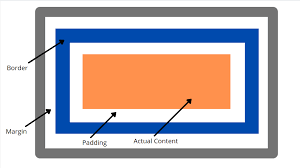

## Indice ##

>[Tarea 1](#1-que-es-css)
>
>[Tarea 2](#2-colores-y-fuentes)
>
>[Tarea 3](#3-diseño-avanzado)
>
>[Tarea 4](#4-crear-una-tarjeta-de-presentacion-con-css-básico)

### 1 Que es CSS ###
[Que es CSS](./que_es_css)

>1. **¿Qué es CSS y para qué sirve?**  
>   - Busca en Internet qué es CSS (Cascading Style Sheets) y cuál es su función en el > >    desarrollo de páginas web.  
>   - Escribe una breve definición con tus palabras explicando para qué sirve y qué problemas soluciona.
>
>
>2. **Formas de aplicar CSS en HTML**  
>   - Investiga las diferentes formas de aplicar CSS a una página web. Debes describir y mostrar un ejemplo de cada una de estas:
>     - **CSS en línea (inline)**: Aplicando estilos directamente en el atributo de un elemento HTML.
>     - **CSS en el encabezado (internal)**: Usando la etiqueta `<style>` dentro de la cabecera del documento HTML.
>     - **CSS externo**: Vinculando un archivo CSS externo mediante la etiqueta `<link>` en la cabecera del HTML
>
>3. **Recursos de aprendizaje**  
>   - Busca en Internet páginas web y recursos que recomienden para aprender CSS de manera práctica. Algunos ejemplos pueden ser blogs, tutoriales o plataformas de aprendizaje.  
>   - Crea una lista de al menos 3 recursos confiables y explica brevemente por qué crees que pueden ser útiles.
>
>Objetivo:
>Este ejercicio te permitirá familiarizarte con CSS, aprender cómo aplicarlo en tus proyectos y descubrir recursos donde podrás seguir profundizando en este lenguaje de diseño.
>
>Crea un repositorio CSS en github y crea un fichero que_es_css.html, deberás ir a ajustes y pages para poder dar permisos para ver como página web

## 2 Colores y fuentes ##
[Colores y fuentes](./colores_y_fuentes.html)

>1. Crea un archivo HTML con varios párrafos y títulos (h1, h2, h3).
>
>2. Usa CSS para aplicar diferentes colores a los títulos y párrafos.
>
>3. Cambia la fuente y el tamaño de texto para cada tipo de título y párrafo.

## 3 Diseño avanzado ##

>Explica para que sirven:
>
>“CSS margin”
>
>“CSS padding”
>
>“CSS border”
>
>“CSS width and height”
>
>

## 4 Crear una tarjeta de presentacion con CSS básico ##

>Instrucciones:

1.    Descripción del reto
Vas a diseñar una tarjeta de presentación personal utilizando HTML y CSS. Tu objetivo es aprender a definir márgenes, relleno (padding), bordes y dimensiones, aplicando los estilos directamente en el archivo CSS.
1.    Requisitos del diseño
>    -    Contenido de la tarjeta:
>La tarjeta debe contener los siguientes elementos:
>    -    Tu nombre completo.
>    -    Tu profesión o título.
>    -    Una breve descripción sobre ti (2-3 frases).
>    -    Estilos de la tarjeta (con CSS):
>Investiga cómo aplicar los siguientes estilos y aplícalos a tu tarjeta:
>    -    Define un margen exterior para separar la tarjeta de los bordes de la pantalla.
>    -    Aplica relleno (padding) dentro de la tarjeta para que el texto no toque los bordes internos.
>    -    Añade un borde alrededor de la tarjeta con un grosor y color que elijas.
>    -    Define el ancho y alto de la tarjeta para que tenga un tamaño bien proporcionado (por ejemplo, 300px de ancho y 200px de alto).
>    -    Cambia el color de fondo de la tarjeta para darle estilo.
>
>1.    Estructura básica del HTML
>Debes utilizar una estructura básica en HTML. Aquí te dejo un ejemplo inicial que puedes modificar:
>
>\

>
>  \<h2>Tu Nombre\</h2>
>
>  \<h3>Tu Profesión\</h3>
>
>  \
Descripción breve sobre ti.\

>\

>
>1.    Vinculación con CSS
>Crea un archivo CSS separado y enlázalo a tu HTML para aplicar los estilos que investigues.
>1.    Recursos
>Si no sabes por dónde empezar, busca en Internet términos como:
>    -    “CSS margin”
>    -    “CSS padding”
>    -    “CSS border”
>    -    “CSS width and height”